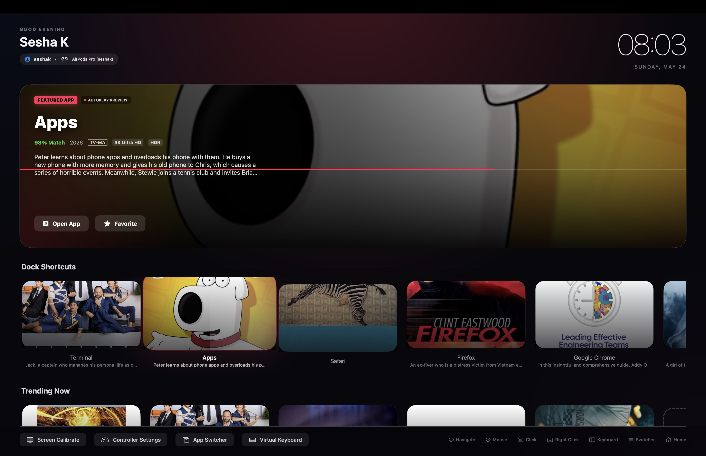

# MacLauncher

MacLauncher is a custom launcher for macOS designed with a sleek, 10-foot television interface. Enjoy a cinematic Hero Banner Carousel and smooth, endless horizontal scrolling for your applications, providing a premium couch-friendly experience.

## Features

- **TV-Style Interface**: A gorgeous, dark-themed UI reminiscent of premium streaming platforms.
- **Hero Banner Carousel**: Massive, immersive featured content area.
- **Dynamic Metadata**: Streamed descriptions, logos, and high-quality background images fetched automatically based on the app's name.
- **D-Pad Accelerated Scrolling**: Navigation accelerates seamlessly when holding down directional inputs.

## How to Use

1. **Build and Run**: Use the provided `build.sh` script to compile and run the application.
   ```bash
   ./build.sh
   ```
2. **Navigation**: Use your keyboard or game controller to navigate the UI.

### Inputs and Controls

| Action | Keyboard Input | Game Controller |
| :--- | :--- | :--- |
| **Navigate Up/Down** | <kbd>Up Arrow</kbd> / <kbd>Down Arrow</kbd> | D-Pad Up / D-Pad Down |
| **Navigate Left/Right** | <kbd>Left Arrow</kbd> / <kbd>Right Arrow</kbd> | D-Pad Left / D-Pad Right |
| **Scroll Tracks** | Scroll Wheel / Trackpad Swipe | Left Thumbstick |
| **Select / Launch** | <kbd>Return</kbd> / <kbd>Enter</kbd> | <kbd>A</kbd> Button / <kbd>X</kbd> Button (PlayStation) |
| **Cancel / Back** | <kbd>Escape</kbd> | <kbd>B</kbd> Button / <kbd>O</kbd> Button (PlayStation) |
| **App Switcher** | Tap <kbd>Option</kbd> (<kbd>⌥</kbd>) or <kbd>Command</kbd> (<kbd>⌘</kbd>) | <kbd>Menu</kbd> / <kbd>Options</kbd> Button |

## Setup
- Clone the repository.
- Ensure you have Xcode Command Line Tools installed.
- Compile and test locally.
